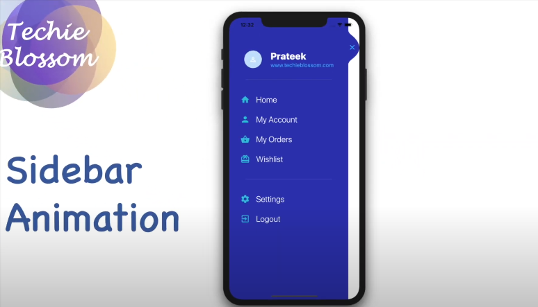

# SIDEBAR ANIMATION
👨‍🏫APP FLUTTER DE ANIMAÇÃO DA BARRA LATERAL PARA ANDROID E IOS.

 <br>

## DESCRIÇÃO:
A animação da barra lateral é um recurso comum em aplicativos web e móveis que permite aos usuários acessar facilmente opções de navegação e outras funcionalidades. A barra lateral está posicionada no lado esquerdo da tela e inicialmente oculta. Quando o usuário clica no ícone do menu hambúrguer, a barra lateral desliza para fora da esquerda, revelando as opções de navegação. Quando o usuário clica em qualquer uma das opções de navegação, a página correspondente é exibida na área de conteúdo principal da tela. Para fechar a barra lateral, o usuário pode clicar na seta para trás ou clicar em qualquer lugar fora da barra lateral.

## FUNCIONALIDADES:
* **Estado inicial:** A barra lateral está oculta, com apenas o ícone do menu de hambúrguer visível.
* **No menu hambúrguer clique em:**
 * A barra lateral desliza para fora da esquerda, revelando as opções de navegação.
 * O ícone do menu de hambúrguer foi substituído por uma seta para trás.
* **Na opção de navegação clique em:**
 * A página correspondente é exibida na área de conteúdo principal da tela.
 * A barra lateral permanece aberta.
* **Na seta para trás, clique ou clique fora:**
 * A barra lateral desliza para a esquerda, ocultando as opções de navegação.
 * A seta para trás é substituída pelo ícone do menu de hambúrguer.

## EXECUTANDO O PROJETO:
### 1. VERIFICAR DEPENDÊNCIAS:
Dentro do diretório `./CODIGO`, execute o seguinte comando no terminal para garantir que todas as dependências do projeto sejam instaladas:

```
flutter pub get
```

Isso garantirá que todos os pacotes listados no arquivo `pubspec.yaml` sejam baixados e instalados corretamente.

## 2. EXECUTAR O APLICATIVO NO EMULADOR OU DISPOSITIVO FÍSICO:
Para executar o aplicativo Flutter no seu emulador ou dispositivo físico, use o comando:

```
flutter run
```

Este comando irá compilar o aplicativo e instalá-lo no dispositivo ou emulador conectado. Certifique-se de que o dispositivo esteja conectado via USB e com a depuração USB ativada, se estiver usando um dispositivo físico Android.

## GERANDO O APLICATIVO:

- **Para Android:**

  Primeiro, certifique-se de que o aplicativo esteja funcionando corretamente usando `flutter run`.

  Em seguida, para gerar o APK, você pode usar o comando:

  ```
  flutter build apk
  ```

  Isso compilará o projeto Flutter em um arquivo APK, que pode ser encontrado na pasta `build\app\outputs\flutter-apk`.

- **Para IOS:**

   Para gerar um aplicativo Flutter para iOS, você precisa de um ambiente de desenvolvimento configurado corretamente no macOS, pois o desenvolvimento iOS é suportado apenas nesse sistema operacional. Aqui estão os passos básicos para gerar um aplicativo Flutter para iOS:

   1. **MacOS:** Certifique-se de estar usando um computador com macOS.
      
   2. **Xcode:** Instale o Xcode na sua máquina a partir da Mac App Store. O Xcode inclui ferramentas essenciais de desenvolvimento para iOS, como simuladores e o compilador Swift.

   3. **Flutter SDK:** Tenha o Flutter instalado e configurado corretamente no seu ambiente. Você pode baixar o Flutter no site oficial e seguir as instruções de instalação para macOS.

   4. **Cocoapods:** Instale o Cocoapods, que é um gerenciador de dependências para projetos iOS. Você pode instalá-lo usando o Terminal com o comando:

      ```bash
      sudo gem install cocoapods
      ```

   5. **Gerar o Pacote do Aplicativo (IPA):**

      Para gerar um arquivo IPA do seu aplicativo Flutter para distribuição ou teste em dispositivos iOS, siga estes passos:

      - Abra o projeto no Visual Studio Code.
      - No terminal, execute o seguinte comando:

      ```bash
      flutter build ios --release
      ```

      Esse comando compilará o aplicativo Flutter para iOS em modo release.

      - Após a conclusão do processo de compilação, você encontrará o arquivo IPA gerado no diretório `build/ios/archive`.

## NÃO SABE?
- Entendemos que para manipular arquivos em muitas linguagens e tecnologias relacionadas, é necessário possuir conhecimento nessas áreas. Para auxiliar nesse aprendizado, oferecemos cursos gratuitos disponíveis:
* [CURSO DE DART](https://github.com/VILHALVA/CURSO-DE-DART)
* [CURSO DE FLUTTER](https://github.com/VILHALVA/CURSO-DE-FLUTTER)
* [CURSO DE KOTLIN](https://github.com/VILHALVA/CURSO-DE-KOTLIN)
* [CURSO DE SWIFT](https://github.com/VILHALVA/CURSO-DE-SWIFT)
* [CURSO DE HTML E CSS](https://github.com/VILHALVA/CURSO-DE-HTML-E-CSS)
* [CONFIRA MAIS CURSOS](https://github.com/VILHALVA?tab=repositories&q=+topic:CURSO)

## CREDITOS:
- [PROJETO CRIADO PELO "TechieBlossom"](https://github.com/TechieBlossom/sidebar_animation_flutter)
- [VEJA O VIDEO DESSE PROJETO](https://youtu.be/oExw0U4U_UI?si=5HQXrK9NoyLlWEUw)
- [VEJA A PLAYLIST DE PROJETOS](https://youtube.com/playlist?list=PLkGOQPVFMSgybQKLEjAN-mVfDxW4UAiEJ&si=XhhxKcMZwtXtXx2i)
- [PROJETO EDITADO PELO VILHALVA](https://github.com/VILHALVA)


